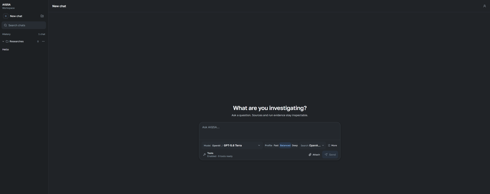

# AIQSA

[](https://github.com/insciqq/AIQSA/actions/workflows/release.yml)
[](https://github.com/insciqq/AIQSA/releases/latest)
[](LICENSE)

Self-hosted Question → Search → Answer for people and small teams who want an AI workspace with explicit control over providers, models, search, and run data.



AIQSA combines a conversation UI with inspectable execution: users can choose a concrete model and search strategy for each run, then review citations, reasoning, events, usage, and branch history. Workspace data stays in your PostgreSQL database and private S3-compatible storage; content selected for a run is sent to the configured AI provider.

## Highlights

- Native OpenAI, Anthropic, Gemini Interactions, and OpenRouter provider adapters, plus manual OpenAI-compatible Chat endpoints.
- Optional OpenAI web search, native Gemini Google Search, and Perplexity search through OpenRouter.
- Branchable conversations, saved chats, projects, prompt presets, and attachments.
- Inspectable citations, reasoning, provider events, request previews, and token usage.
- Multi-user accounts, invitations, access rules, model entitlements, and an admin console.
- Admin-managed MCP servers with per-user/group access, personal credentials, multi-server tool use, and isolated local workloads.
- Optional Google and Yandex sign-in.

## Quick start

You need Docker Engine with the Docker Compose plugin and OpenSSL.

Copy the HTTPS or SSH clone URL from this repository's **Code** menu. This can
be the upstream repository or your own fork. Then clone it into a stable local
directory name:

```bash
git clone REPOSITORY_URL aiqsa
cd aiqsa
bash prepare-secrets.sh
```

Replace `REPOSITORY_URL` with the copied clone URL. The setup script asks only
for the initial administrator email, creates a private `.env`, generates its
password and required infrastructure secrets, and prints the administrator
password once. Save that password in a password manager. If `.env` already
exists, the script exits without reading or changing it. For an unattended
setup, pass the email explicitly:

```bash
bash prepare-secrets.sh --admin-email owner@example.com
```

See [Configuration](docs/configuration.md) if you prefer to create `.env`
manually or need to change optional settings.

Then start AIQSA:

```bash
docker compose pull
docker compose up -d
```

Open [http://localhost:3000](http://localhost:3000) and sign in with the initial administrator account from `.env`.

Then open `Control Center -> Providers`. Choose OpenAI, Anthropic, Gemini, or OpenRouter, paste its API key, and select **Test & Save**; AIQSA installs every current reviewed chat model visible to that key, chooses one recommended default, and links straight back to chat. For another OpenAI-compatible Chat API, choose **Connect custom endpoint**, enter its API root, manual model ID, and key, then use the same **Test & Save** flow. The normal single-administrator path does not require group setup. The first administrator is already an owner of the built-in, undeletable `Full access` group, whose explicit members are entitled to all current and future providers, models, search strategies, and MCP servers; credentials and personal MCP secrets remain separate. Provider keys and SMTP settings are database-managed and are not normal `.env` inputs.

That is enough for local use. A domain, SMTP server, and OAuth credentials are optional. PostgreSQL and uploaded objects live in named Docker volumes, so a normal rebuild or update does not erase them.

The bundled ToolHive service lets an administrator add remote, npm, PyPI, or digest-pinned OCI MCP servers without changing the one-command bootstrap. Local MCPs run in sibling containers, but ToolHive has trusted access to the host Docker socket; install only MCP code you trust. See [configuration](docs/configuration.md#mcp-servers) before enabling local MCPs.

## Updating

The default `.env` follows the published `latest` image. From the existing
installation directory, create a verified backup, update the small Compose
checkout, pull the current image, and restart the stack:

```bash
ops/backup/create.sh /secure/aiqsa-backups
git pull --ff-only
docker compose pull
docker compose up -d
docker compose ps
curl -fsS http://127.0.0.1:3000/api/health/ready
```

Use an existing protected directory instead of the example backup path. The
startup job applies committed database migrations before the application
becomes ready. The local `.env`, existing users, chats, settings, and uploaded
objects remain in the installation and named Docker volumes. Review release
notes and changes to `.env.example` before large version jumps or when new
configuration is required. To hold a specific release, set `AIQSA_IMAGE` in
the same `.env` to a tag such as `ghcr.io/insciqq/aiqsa:X.Y.Z`.

Stopping the stack first is normally unnecessary. Never run
`docker compose down -v` during an update: `-v` deletes the persistent database
and object-storage volumes. See [Deployment and updates](docs/deployment.md) for
backup, migration, recovery, and older-installation guidance.

## Documentation

- [Configuration](docs/configuration.md) — providers, MCP servers, SMTP, OAuth, networking, and all operator settings.
- [Deployment and updates](docs/deployment.md) — running on a server, TLS, backups, and safe updates.
- [Development](docs/development.md) — the separate disposable development and test stack.

AIQSA is pre-1.0 and intended for small, operator-managed installations. It is not currently an HA system and does not provide user-self-service provider keys or billing; administrators may assign an installation-managed credential directly to a user or group.

## License

AIQSA is licensed under the [GNU Affero General Public License v3.0 only](LICENSE).
