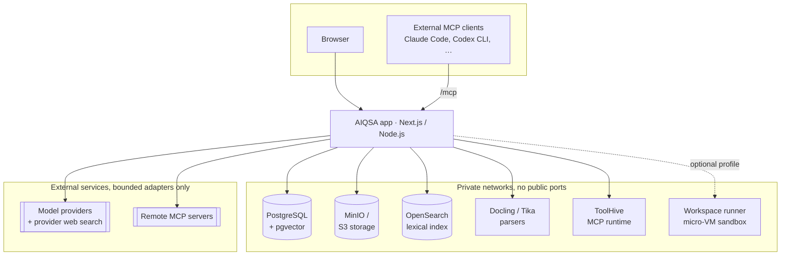

<div align="center">


# AIQSA

**Self-hosted, model-agnostic AI workspace for teams.**

One conversation-first interface for OpenAI, Anthropic, Gemini, DeepSeek, OpenRouter, and OpenAI-compatible models, with MCP tools, web search, private Knowledge bases, and Memory. Runs on your own infrastructure with Docker Compose.

<p>
  <a href="https://github.com/insciqq/AIQSA/releases/latest"></a>
  <a href="https://github.com/insciqq/AIQSA/actions/workflows/ci.yml"></a>
  <a href="https://github.com/insciqq/AIQSA/actions/workflows/release.yml"></a>
  <a href="https://github.com/insciqq/AIQSA/pkgs/container/aiqsa"></a>
  <a href="LICENSE"></a>
</p>

<p>
  <a href="#quick-start">Quick start</a> ·
  <a href="#features">Features</a> ·
  <a href="#integrations">Integrations</a> ·
  <a href="#architecture">Architecture</a> ·
  <a href="#development">Development</a> ·
  <a href="#contributing">Contributing</a>
</p>

</div>

<br>


<br>

AIQSA is a multi-user web interface for working with large language models without tying an installation to one vendor. Pick the exact model for each message, add MCP tools, Knowledge, Memory, or web search only when they help, and keep conversations, Projects, Assistants, and files in one workspace that you host yourself.

The interface keeps control explicit and the conversation calm. You choose the model and optional capabilities before sending, see concise live status while work is in progress, and get the answer with Sources, generated outputs, and direct follow-up actions. Provider requests, retrieval internals, and tool traces stay private operational data instead of becoming a second inspection UI.

## Why AIQSA

- **Any provider, one interface.** Native adapters for OpenAI, Anthropic, Gemini, DeepSeek, and OpenRouter, plus any OpenAI-compatible endpoint. Switch models per message.
- **Capabilities are opt-in.** Enable MCP servers, an ordered web-search plan, Knowledge bases, or Memory per message instead of forcing every conversation through the same pipeline.
- **Conversation-first answers.** Read the response, open Sources or generated files when present, then continue, branch, or regenerate. No execution dashboard to navigate.
- **Built for operator-managed teams.** Accounts, invitations, access groups, provider credentials, model availability, search integrations, SMTP, and MCP servers are managed from the Control Center.
- **Your data stays yours.** Workspace state lives in PostgreSQL and private S3-compatible storage. Only the content selected for a run is sent to the provider and tools used by that run.

## Features

<table>
<tr>
<td width="50%" valign="top">

**Conversations**<br>
Branchable message history, Projects with role-based access, nested folders, private attachments, chat continuation summaries, and sanitized read-only share links.

</td>
<td width="50%" valign="top">

**Exact model control**<br>
Per-model parameters, optional reasoning and streaming settings where a provider supports them, and a server-filtered catalog so the browser can never select a hidden or unavailable target.

</td>
</tr>
<tr>
<td width="50%" valign="top">

**Knowledge**<br>
Private Knowledge bases with hybrid vector and lexical retrieval over native document text and printed Russian/English text recognized from scanned PDFs and images. Optional hosted reranking.

</td>
<td width="50%" valign="top">

**Web search**<br>
Ordered search plans with up to three sources per message, compatibility checks, normalized citations, and answer-bound Sources.

</td>
</tr>
<tr>
<td width="50%" valign="top">

**MCP tools**<br>
Remote Streamable HTTP servers or ToolHive-managed npm, PyPI, and OCI servers in sibling containers. OAuth flows, readiness checks, per-user enablement, and approval before protected tool execution.

</td>
<td width="50%" valign="top">

**Memory**<br>
Explicitly saved facts and retained-chat recall with private management, lifecycle, and deletion controls. The same facts are available to external MCP clients such as Claude Code and Codex CLI.

</td>
</tr>
<tr>
<td width="50%" valign="top">

**Assistants**<br>
Save a model, instructions, run controls, Search plan, MCP allowlist, and starter prompts as one versioned, shareable object with exact revision provenance on every run.

</td>
<td width="50%" valign="top">

**Workspace (optional)**<br>
Let the model run commands and work with files inside an isolated micro-VM sandbox (Microsandbox on KVM), enabled per installation through the `workspace` Compose profile.

</td>
</tr>
<tr>
<td width="50%" valign="top">

**Administration**<br>
Multi-user accounts, invitations, access rules and groups, optional Google and Yandex sign-in, usage views, and a Control Center for providers, models, search, SMTP, and MCP.

</td>
<td width="50%" valign="top">

**Interface**<br>
System, light, and dark themes, responsive desktop and mobile layouts, code and math rendering, and private S3-compatible uploads.

</td>
</tr>
</table>

## Quick start

This repository contains application code, image builds and the local development
profile. Production deployment is maintained separately by the installation operator.

Start the disposable development stack:

```bash
git clone https://github.com/insciqq/AIQSA.git
cd AIQSA
docker compose -f docker-compose.dev.yml up -d --build app
```

Open `http://localhost:3000`. The development Compose file supplies disposable
credentials; optional local overrides are documented in `.env.example`. Existing
local profile settings live in the ignored `.aiqsa/local-dev-profile/` directory.
See [Development](#development) for verification commands.

## Integrations

| Area | Supported today |
| --- | --- |
| **Model providers** | OpenAI, Anthropic, Google Gemini, DeepSeek, OpenRouter, and any OpenAI-compatible endpoint |
| **Web search** | OpenAI web search, Anthropic web search, Gemini Google Search grounding, DeepSeek web search, and Perplexity Sonar through OpenRouter |
| **Tools** | Remote MCP servers over Streamable HTTP, and npm, PyPI, or digest-pinned OCI MCP servers run by ToolHive |
| **Documents** | PDF, office, and text formats through Docling and Apache Tika, with printed Russian/English OCR for scans and images |
| **Sign-in** | Email and password with invitations, plus optional Google and Yandex OAuth |
| **Storage** | PostgreSQL with pgvector, S3-compatible object storage (bundled MinIO), and OpenSearch for rebuildable lexical indexes |
| **Delivery** | Multi-platform images on GHCR with immutable digests, a companion pgvector PostgreSQL image |

## Architecture

AIQSA is a TypeScript / Next.js modular monolith: browser UI, authenticated route handlers, domain logic, persistence, and external adapters ship as one application. The supported production shape is a single-host, single-replica Docker Compose installation in which the app is the only public boundary.



- **PostgreSQL** owns tenancy, conversations, runs, immutable accepted bindings, and recovery state. Vectors live in pgvector.
- **Object storage** owns attachment, Knowledge, and generated Workspace bytes behind relational ownership checks. It is never a public file host.
- **OpenSearch** holds only rebuildable Knowledge and Memory lexical projections; PostgreSQL revalidates every hit before it is used.
- **Sidecars** (parsers, ToolHive, Workspace runner) are bounded helpers on private networks with no database, storage, or provider credentials.

The durable boundaries and their rationale are in [`agent_docs/ARCHITECTURE.md`](agent_docs/ARCHITECTURE.md).

## Personal Memory over MCP

Each user can authorize a compatible external MCP client to use the same Personal Memory facts as the AIQSA Memory UI. Use the installation's public URL with `/mcp`, for example `https://aiqsa.example/mcp`. This is an inbound connection to AIQSA and is separate from the MCP servers that AIQSA calls from its own chats.

```bash
# Claude Code: add the server, then run /mcp inside Claude Code to finish browser authentication
claude mcp add --transport http aiqsa-memory https://aiqsa.example/mcp

# Codex CLI
codex mcp add aiqsa-memory --url https://aiqsa.example/mcp
codex mcp login aiqsa-memory

# Protocol check with MCP Inspector (Streamable HTTP, same /mcp URL, complete its OAuth flow)
npx -y @modelcontextprotocol/inspector
```

The consent page names the client and grants one fact-only permission. The client can discover `add_memory`, `search_memories`, `list_memories`, `get_memory`, `update_memory`, and `delete_memory`. It cannot read chat history, and AIQSA does not run a model or compose answers for these calls; the model in the external client decides when to use the tools. Semantic search may still use AIQSA's configured Memory embedding and score-only reranker routes.

Review or revoke a client in **Settings → Connected apps**. Revocation stops future calls for that client and keeps every stored fact. See the [Codex MCP](https://developers.openai.com/codex/mcp/), [Claude Code MCP](https://code.claude.com/docs/en/mcp), and [MCP Inspector](https://github.com/modelcontextprotocol/inspector) documentation for client-specific behavior.

## Development

Routine deterministic checks need no database, provider key, or external service:

```bash
npm ci
npm run check:hermetic
```

Container parity uses only the separate disposable development topology:

```bash
docker compose -f docker-compose.dev.yml up -d --build
npm run check:container
```

Use a unique disposable Compose project for automated stateful checks; preserve the operator's local development profile and volumes. The complete verification contract is in [`agent_docs/TESTING.md`](agent_docs/TESTING.md).

| Document | Owns |
| --- | --- |
| [`agent_docs/ARCHITECTURE.md`](agent_docs/ARCHITECTURE.md) | Dependency direction, deployment shape, data and egress boundaries |
| [`agent_docs/ENV_VARIABLES.md`](agent_docs/ENV_VARIABLES.md) | The complete environment and Compose configuration contract |
| [`agent_docs/SECURITY.md`](agent_docs/SECURITY.md) | Threat model, trust boundaries, and dependency-security policy |
| [`agent_docs/TESTING.md`](agent_docs/TESTING.md) | Verification lanes and test-authoring rules |

## Project status

AIQSA is pre-1.0 and intended for small, operator-managed, single-replica installations. It is not a high-availability system.

The architecture is intended to grow from tool-enabled chat toward agent workflows without presenting planned features as already shipped. Evaluate current releases on the capabilities documented above.

## Contributing

Contributions are welcome. For a substantial product or architecture change, please open an issue first so the intended behavior and scope are clear. See [CONTRIBUTING.md](CONTRIBUTING.md) for the development workflow and [SECURITY.md](SECURITY.md) for private vulnerability reporting. Participation in this project is governed by the [Code of Conduct](CODE_OF_CONDUCT.md).

## License

AIQSA is licensed under the [GNU Affero General Public License v3.0 only](LICENSE).
