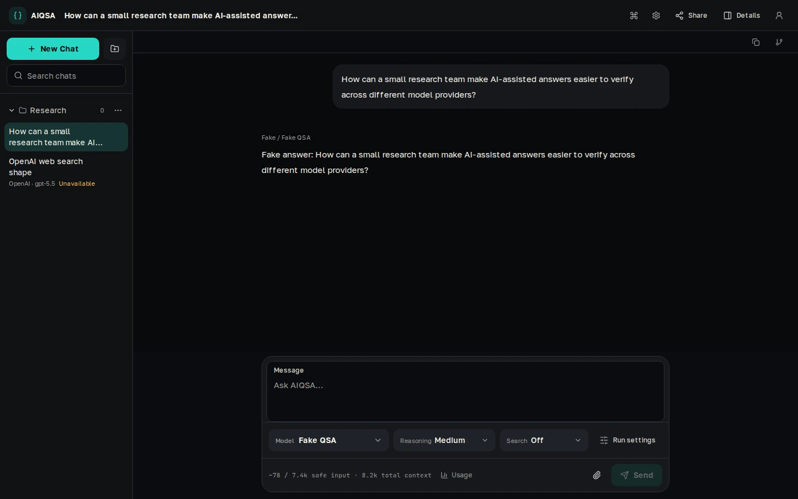

# AIQSA

Self-hosted Question → Search → Answer for teams that want a calm AI workspace without giving up control of providers, models, search, and run data.



AIQSA combines an everyday conversation UI with explicit provider controls and inspectable execution. An operator connects the installation to OpenAI, Anthropic, or OpenRouter; entitled users choose a concrete model and search strategy for each run, while citations, reasoning, events, usage, and branch history remain available when they need them.

It is built for small, operator-managed teams, developers, researchers, and power users who want self-hosted workspace data and a less opaque path from question to answer. Message and attachment content selected for a run is still sent to the configured external AI provider.

## Highlights

- Explicit Question → optional Search → Answer workflow.
- OpenAI Responses, Anthropic Messages, and OpenRouter Chat Completions adapters.
- No Search, OpenAI native web search, and Perplexity tool search through OpenRouter.
- Branchable conversations with edit, regenerate, checkout, and branch-from-here workflows.
- Inspectable run events, request and response previews, citations, reasoning, and provider-reported token usage.
- Private PDF, image, and text-document attachments backed by S3-compatible storage.
- Saved chats, nested projects, project memory, prompt presets, search, and keyboard navigation.
- Email/password accounts, user and group model entitlements, invitations, access rules, and an admin console.
- Optional Google and Yandex sign-in with same-email account merge.
- Immutable sanitized public snapshots that omit private attachments and internal provider payloads.
- Responsive dark and light themes with accessible keyboard and touch behavior.

## Current status

AIQSA is pre-1.0. The supported deployment is a hardened single host with one application replica, PostgreSQL, and private S3-compatible storage. It is not currently an HA system, does not offer per-user provider keys or billing, and has not yet completed its planned 50-user load and quota program. Treat it as an operator-managed installation and validate it against your own workload before broad exposure.

The durable runtime boundary is described in [the architecture notes](agent_docs/ARCHITECTURE.md).

## Try it locally

You need Docker Engine with the Docker Compose plugin and OpenSSL.

```bash
cp .env.example .env
openssl rand -hex 32
```

Put the generated value in `.env` as `AUTH_SESSION_SECRET`, then enable the deterministic local provider:

```dotenv
AUTH_SESSION_SECRET=<generated-value>
AIQSA_FAKE_PROVIDER=1
AIQSA_SHOW_FAKE_PROVIDER=1
```

Start the stack and wait for readiness:

```bash
docker compose up -d --build
docker compose ps
curl -fsS http://127.0.0.1:3000/api/health/ready
```

Open [http://localhost:3000](http://localhost:3000) and sign in with the disposable local fixture:

- Email: `operator@aiqsa.local`
- Password: `AIQSA-local-2026!`

Select **Fake QSA** and send a question. The local seed restores this public fixture credential whenever it runs, and the development app, PostgreSQL, and MinIO use public local credentials. They bind to `127.0.0.1` by default; do not expose this development stack to a LAN or the Internet.

## Provider access

At least one real provider key is required outside the Fake QSA demo. Keys are server-wide installation secrets, not per-user BYOK values.

| Environment variable | Enables |
| --- | --- |
| `OPENAI_API_KEY` | Direct OpenAI models and OpenAI native web search |
| `ANTHROPIC_API_KEY` | Direct Anthropic models |
| `OPENROUTER_API_KEY` | OpenRouter models and Perplexity tool search |

Blank `OPENAI_BASE_URL`, `ANTHROPIC_BASE_URL`, and `OPENROUTER_BASE_URL` values use the standard provider endpoints. Set `OPENROUTER_HTTP_REFERER` to the public AIQSA origin when using OpenRouter.

## Deploy on your server

This is the supported simple topology:

```text
browser -> Nginx + TLS -> 127.0.0.1:3100 -> AIQSA
                                                |-> PostgreSQL
                                                |-> private MinIO
                                                `-> configured AI providers
```

Use a Linux server with Docker Engine and the Docker Compose plugin, a DNS name pointing to the server, inbound ports 80 and 443, and host-installed Nginx and Certbot. The Compose production profile builds the application images from source.

### 1. Configure the server

Clone the repository, then create a private environment file:

```bash
git clone https://gitlab.com/tulnov.dl/aiqsa.git
cd aiqsa
cp .env.example .env
chmod 600 .env
```

Generate deployment-specific secrets. Hex values are convenient for the database URL because they do not require URL encoding.

```bash
openssl rand -hex 32
cat /proc/sys/kernel/random/uuid
```

Set these values in `.env`:

- Runtime: `APP_ENV=production`, `AIQSA_APP_BASE_URL=https://aiqsa.example.com`, `AIQSA_COOKIE_SECURE=1`, and a unique `AUTH_SESSION_SECRET`.
- Trusted proxy: `AIQSA_TRUST_PROXY_HEADERS=1` and `AIQSA_TRUSTED_PROXY_COUNT=1` for the shipped Nginx configuration.
- PostgreSQL: unique `AIQSA_PROD_POSTGRES_DB`, `AIQSA_PROD_POSTGRES_USER`, and `AIQSA_PROD_POSTGRES_PASSWORD`, plus a matching `AIQSA_PROD_DATABASE_URL` that uses host `postgres-prod:5432`.
- Private objects: unique `AIQSA_PROD_S3_ACCESS_KEY_ID` and `AIQSA_PROD_S3_SECRET_ACCESS_KEY`, plus `AIQSA_PROD_S3_BUCKET`.
- Initial administrator: `AIQSA_INITIAL_ADMIN_EMAIL`, `AIQSA_INITIAL_ADMIN_DISPLAY_NAME`, a random UUID in `AIQSA_INITIAL_ADMIN_USER_ID`, and a one-time `AIQSA_INITIAL_ADMIN_PASSWORD`.
- Providers: at least one key from the table above.

Keep `AIQSA_PROD_BIND_ADDRESS=127.0.0.1` and the default `AIQSA_PROD_APP_PORT=3100`. Leave `AIQSA_BOOTSTRAP_LOGIN_ENABLED`, `AIQSA_FAKE_PROVIDER`, `AIQSA_SHOW_FAKE_PROVIDER`, and `PLAYWRIGHT_TEST_AUTH` disabled in an exposed installation.

For a normal multi-user installation, configure SMTP as well:

```dotenv
AIQSA_SMTP_HOST=smtp.example.com
AIQSA_SMTP_PORT=587
AIQSA_SMTP_USER=<smtp-user>
AIQSA_SMTP_PASSWORD=<smtp-password>
AIQSA_SMTP_FROM="AIQSA <aiqsa@example.com>"
AIQSA_SMTP_SECURE=0
AIQSA_SMTP_STARTTLS=1
```

SMTP sends verification, password-reset, and optionally administrator-created invitation emails. Without it, the initial administrator and manually copied invitation links still work, but verification and password-reset emails are not delivered.

### 2. Bootstrap and start

```bash
docker compose --profile prod build app-prod prod-migrate-bootstrap
docker compose --profile prod run --rm prod-migrate-bootstrap
```

The one-shot tools container applies committed migrations and creates the initial administrator and catalog on a fresh database. Save the administrator password in a password manager, then clear `AIQSA_INITIAL_ADMIN_PASSWORD` from `.env`; keep the other initial-administrator identity values stable for safe repeat deployments.

```bash
docker compose --profile prod up -d --no-build app-prod
docker compose --profile prod ps
curl -fsS http://127.0.0.1:3100/api/health/live
curl -fsS http://127.0.0.1:3100/api/health/ready
```

Name `app-prod` in the startup command so Compose does not also start the development service.

### 3. Publish the domain with TLS

Render and enable the shipped [Nginx site](ops/nginx/README.md) with your domain and loopback port `3100`, validate it with `nginx -t`, and reload Nginx. Once DNS resolves and HTTP is reachable, issue the certificate:

```bash
sudo certbot --nginx -d aiqsa.example.com --redirect
sudo nginx -t
curl -fsS https://aiqsa.example.com/api/health/ready
```

Keep the application port on loopback. The shipped proxy deliberately overwrites forwarding headers, disables SSE response buffering, and allows upload headroom.

### 4. Verify the installation

Sign in at `https://aiqsa.example.com/login` with the initial administrator account. Readiness proves secure runtime configuration plus PostgreSQL and private-object access; it deliberately does not call paid provider APIs. Select a model backed by a configured key and send one small question to complete the provider smoke. If enabled, also test an invitation or password-reset email and the search strategy you plan to use.

Before any later update that applies migrations, create and verify a coordinated database and object backup:

```bash
ops/backup/create.sh /secure/aiqsa-backups
```

See [environment variables](agent_docs/ENV_VARIABLES.md), [security boundaries](agent_docs/SECURITY.md), and the backup scripts' `--help` output for deeper operator details.

## Optional OAuth

Google sign-in appears only when both `AIQSA_GOOGLE_OAUTH_CLIENT_ID` and `AIQSA_GOOGLE_OAUTH_CLIENT_SECRET` are set. Register this exact callback:

```text
https://aiqsa.example.com/api/auth/oauth/google/callback
```

Yandex follows the same paired rule for `AIQSA_YANDEX_OAUTH_CLIENT_ID` and `AIQSA_YANDEX_OAUTH_CLIENT_SECRET`:

```text
https://aiqsa.example.com/api/auth/oauth/yandex/callback
```

Grant the Yandex application `login:info` and `login:email`. Callbacks are derived from `AIQSA_APP_BASE_URL`. OAuth is login-only, stores no provider access or refresh token, and remains subject to the installation's access rules and approval policy.

## Development

The routine application check runs through the normal Compose stack:

```bash
docker compose exec -T app npm run check
```

Testing details live in [agent_docs/TESTING.md](agent_docs/TESTING.md). Agent-driven repository work starts with [AGENTS.md](AGENTS.md).

## License

AIQSA is licensed under the [GNU Affero General Public License v3.0 only](LICENSE).
