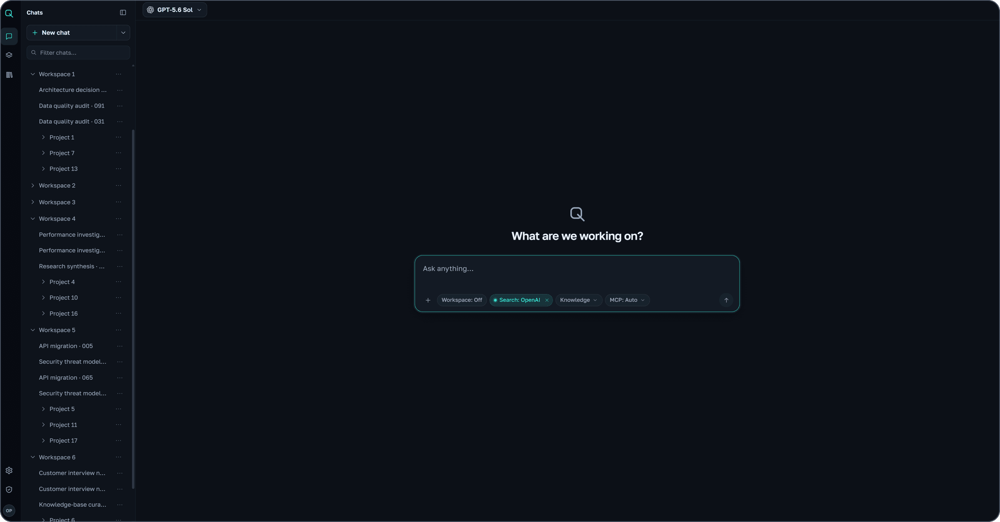

# AIQSA

[](https://github.com/insciqq/AIQSA/releases/latest)
[](https://github.com/insciqq/AIQSA/actions/workflows/ci.yml)

AIQSA is a self-hosted, multi-user web interface for working with models from different providers. It combines chat, Projects, Assistants, files, document search, personal Memory, and MCP tools.



## Features

- OpenAI, Anthropic, Gemini, DeepSeek, OpenRouter, and OpenAI-compatible endpoints, with model selection per message.
- Branching conversations, folders, file attachments, and read-only share links.
- Team Projects, reusable Assistants, invitations, and access groups.
- Knowledge bases with document search, OCR, and source citations.
- Web search, MCP tools, and personal Memory accessible from AIQSA or external MCP clients.
- An optional KVM sandbox for running commands and working with files.

AIQSA is pre-1.0 and designed for small, operator-managed installations with a single application replica.

## System requirements

For a small production installation with the bundled document parsers, plan for:

- 64-bit Linux on amd64 or arm64, Docker Engine with Compose v2, and OpenSSL.
- **4 CPU cores, 24 GB RAM, and 50 GB free SSD space**, plus storage for uploads, indexes, and backups.
- **32 GB RAM or more** for concurrent OCR jobs or the optional Workspace. Workspace also requires `/dev/kvm`; each workspace defaults to 4 GB RAM and 10 GB disk.

These are resource budgets, not measured concurrency limits. No GPU is required; locally hosted model servers need their own resources. OpenSearch requires [`vm.max_map_count` of at least 262144](https://docs.opensearch.org/latest/install-and-configure/install-opensearch/docker/#linux-settings).

## Install

```bash
git clone https://github.com/insciqq/AIQSA.git
cd AIQSA
sh scripts/configure.sh
```

Set `AIQSA_INITIAL_ADMIN_EMAIL` and `AIQSA_APP_BASE_URL` in `.env`, then start the application:

```bash
docker compose up -d
```

Open the configured URL ([localhost:3000](http://localhost:3000) by default) and sign in with the email and generated `AIQSA_INITIAL_ADMIN_PASSWORD` from `.env`. Configure model providers in the Control Center. For internet access, put an HTTPS reverse proxy in front of port 3000 and set the public URL in `.env`.

The stack uses prebuilt images and persistent Docker volumes. Keep `.env` with your backups: it contains the keys needed to read encrypted configuration.

## Update

```bash
docker compose pull && docker compose up -d
```

This tracks stable releases and applies database migrations before starting the application. See the [release notes](https://github.com/insciqq/AIQSA/releases) before updating. Images are published on [GHCR](https://github.com/insciqq/AIQSA/pkgs/container/aiqsa); their digests are included in each release.

## Development

Use Node.js 22. Deterministic checks run without a database or provider credentials:

```bash
npm ci
NODE_OPTIONS=--max-old-space-size=8192 npm run check:hermetic
```

The separate `docker-compose.dev.yml` runs the development server. See [CONTRIBUTING.md](CONTRIBUTING.md) for contribution and verification guidance.

## Further reading

- [Architecture and integrations](human_docs/architecture.md)
- [Personal Memory through MCP](human_docs/personal-memory-mcp.md)
- [Security reporting](SECURITY.md) and [Code of Conduct](CODE_OF_CONDUCT.md)

## License

[GNU Affero General Public License v3.0 only](LICENSE).
