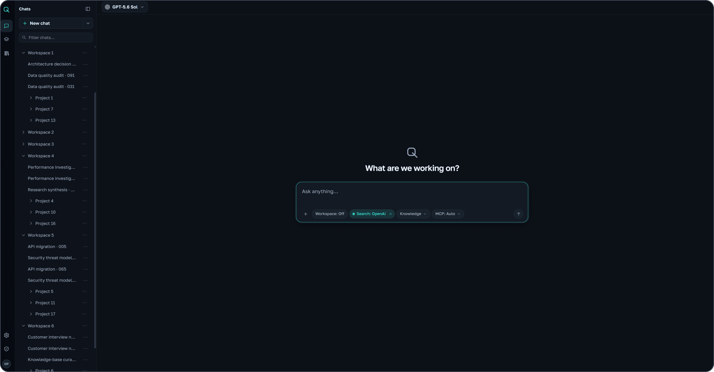

# AIQSA

[](https://github.com/insciqq/AIQSA/releases/latest)
[](https://github.com/insciqq/AIQSA/actions/workflows/ci.yml)

AIQSA is a self-hosted, multi-user web interface for working with models from different providers. It combines chat, Projects, Assistants, files, document search, personal Memory, and MCP tools.



## Features

- OpenAI, Anthropic, Gemini, DeepSeek, OpenRouter, and OpenAI-compatible endpoints, with model selection per message.
- Branching conversations, folders, file attachments, and read-only share links.
- Team Projects, reusable Assistants, invitations, and access groups.
- Knowledge bases with document search, OCR, and source citations.
- Web search, MCP tools, and personal Memory accessible from AIQSA or external MCP clients.
- An optional KVM sandbox for running commands and working with files.

AIQSA is pre-1.0 and designed for small, operator-managed installations with a single application replica.

## System requirements

For local use by one person with external model providers:

- 64-bit Linux on amd64 or arm64, Docker Engine 25.0 or newer with Compose 2.29.7 or newer, bash 4 or newer, git, and OpenSSL.
- **KVM (`/dev/kvm`) is required.** Workspace runs commands in KVM virtual machines and much of AIQSA depends on it; installations without it are not supported. On cloud and other virtual machines enable nested virtualization, or use a bare-metal host.
- **Minimum: 2 CPU cores, 8 GB RAM, and 50 GB free SSD space**, plus storage for uploads and backups. Each workspace defaults to 4 GB RAM and 10 GB disk.
- **Recommended: 16 GB RAM** for several concurrent workspaces, active Knowledge ingestion and OCR.

Memory use depends on document size and workload. No GPU is required; locally hosted model servers need their own resources. OpenSearch requires [`vm.max_map_count` of at least 262144](https://docs.opensearch.org/latest/install-and-configure/install-opensearch/docker/#linux-settings).

## Install

```bash
git clone https://github.com/insciqq/AIQSA.git
cd AIQSA
./aiqsa.sh install --base-url http://localhost:3000 --admin-email admin@example.com
```

`install` checks the host (Docker, Compose, `vm.max_map_count`, memory, disk, port, clock and KVM), creates `.env` with unique secrets unless it already exists, starts the stack and waits until it is ready. Without flags it asks for the URL users will open and the administrator email. It never changes host settings: a failed check prints the exact command to fix it. It refuses a host without usable `/dev/kvm` before changing anything and enables Workspace with the matching KVM group. `./aiqsa.sh doctor` rechecks the host, `.env` and the running stack at any time, and `./aiqsa.sh help` lists every command and flag.

Open the configured URL ([localhost:3000](http://localhost:3000) by default) and sign in with the email and generated `AIQSA_INITIAL_ADMIN_PASSWORD` from `.env`. Configure model providers in the Control Center. For internet access, put an HTTPS reverse proxy in front of port 3000 and set the public URL in `.env`. Its upstream read timeout must exceed the Memory admission timeout (30 seconds by default, up to 120), because sending a message waits for Memory preparation.

To prepare `.env` without starting anything, run `./aiqsa.sh configure`, edit `.env`, then `./aiqsa.sh up` (or `docker compose up -d`).

The stack uses prebuilt images and persistent Docker volumes. Keep `.env` with your backups: it contains the keys needed to read encrypted configuration.

## Update

**Installations on v0.2.0–v0.2.30 (bundled MinIO):** back up PostgreSQL first, then update to v0.2.34, not further, and complete its [MinIO → SeaweedFS upgrade runbook](https://github.com/insciqq/AIQSA/blob/v0.2.34/UPGRADING_FROM_MINIO.md). Later releases no longer contain this one-time storage migration. Before updating past v0.2.34, remove any `minio-legacy` service and `/legacy` mount from your Compose overrides and drop `storage-migration` from `COMPOSE_PROFILES`.

**Local MCP servers are removed after v0.2.34.** Local (npm, PyPI, OCI) MCP servers and the bundled ToolHive runtime are removed; remote MCP servers are unaffected. Before the first start of the new release, set `AIQSA_ACCEPT_LOCAL_MCP_REMOVAL=1` in `.env`: startup then deletes leftover local servers and local configurations. Without it, startup stops with `local_mcp_removal_acknowledgement_required` and changes nothing; the flag is ignored once nothing local is left. Upstream OAuth grants of removed servers are not revoked; revoke them at the provider if needed. Optionally, before updating, run `docker compose --profile maintenance run --rm mcp-maintenance --execute` in the current release to remove its ToolHive workloads. `--remove-orphans` removes the `toolhive-runtime` container; afterwards remove the `<project>_toolhive_data` volume, any leftover `aiqsa-<hex>-<token>` containers and `toolhivelocal/*` images by hand.

**First update to this release.** Released checkouts up to v0.2.34 do not contain `aiqsa.sh`, so this update is manual. If `.env` pins `AIQSA_IMAGE` (the v0.2.34 runbook did), set it to the new release first, for example `AIQSA_IMAGE=ghcr.io/insciqq/aiqsa:X.Y.Z`. Then update the checkout and start the stack:

```bash
git pull --ff-only                          # installation on a branch
git fetch --tags && git checkout vX.Y.Z     # installation on a release tag (detached HEAD)
./aiqsa.sh up                               # or: docker compose pull && docker compose up -d --remove-orphans
```

**Later updates** use the CLI:

```bash
./aiqsa.sh upgrade                # installation on a branch
./aiqsa.sh upgrade --to vX.Y.Z    # installation on a release tag (detached HEAD): always pass --to
```

`upgrade` stops on local changes to tracked files or a MinIO-era installation and asks you to confirm a current backup of PostgreSQL, object storage and `.env` (`--backup-confirmed` without a prompt). It then updates the checkout with `git pull --ff-only`, or moves it to the release tag given with `--to`. Images follow the image settings in `.env` (`AIQSA_IMAGE`, `AIQSA_WORKSPACE_RUNNER_IMAGE`), otherwise the newest release: `upgrade` refuses before changing anything when a pinned image belongs to another release, or when `--to` names an older release while the images are unpinned, and prints the exact `AIQSA_IMAGE=ghcr.io/insciqq/aiqsa:X.Y.Z` line to set. It then pulls the images before any container is replaced, restarts with `--remove-orphans` and waits until the stack is ready; a Workspace runner that is not ready is only a warning, because the rest of AIQSA works without it. It never rewrites `.env`: keys new in `.env.example` are reported, and `--add-missing-keys` appends them.

The equivalent manual update: update the checkout first so Compose uses the release's configuration, then pull the images and restart:

```bash
git pull --ff-only
docker compose pull && docker compose up -d --remove-orphans
```

This tracks stable releases and applies database migrations before starting the application. See the [release notes](https://github.com/insciqq/AIQSA/releases) before updating. Images are published on [GHCR](https://github.com/insciqq/AIQSA/pkgs/container/aiqsa); their digests are included in each release.

If `docker compose pull` reports `pull access denied for minio/mc`, the checkout is older than v0.2.31: stop at v0.2.34 and follow its runbook as described above.

## Development

Use Node.js 22. Deterministic checks run without a database or provider credentials:

```bash
npm ci
NODE_OPTIONS=--max-old-space-size=8192 npm run check:hermetic
```

The separate `docker-compose.dev.yml` runs the development server. See [CONTRIBUTING.md](CONTRIBUTING.md) for contribution and verification guidance.

## Further reading

- [Security reporting](SECURITY.md) and [Code of Conduct](CODE_OF_CONDUCT.md)

## License

[GNU Affero General Public License v3.0 only](LICENSE).
