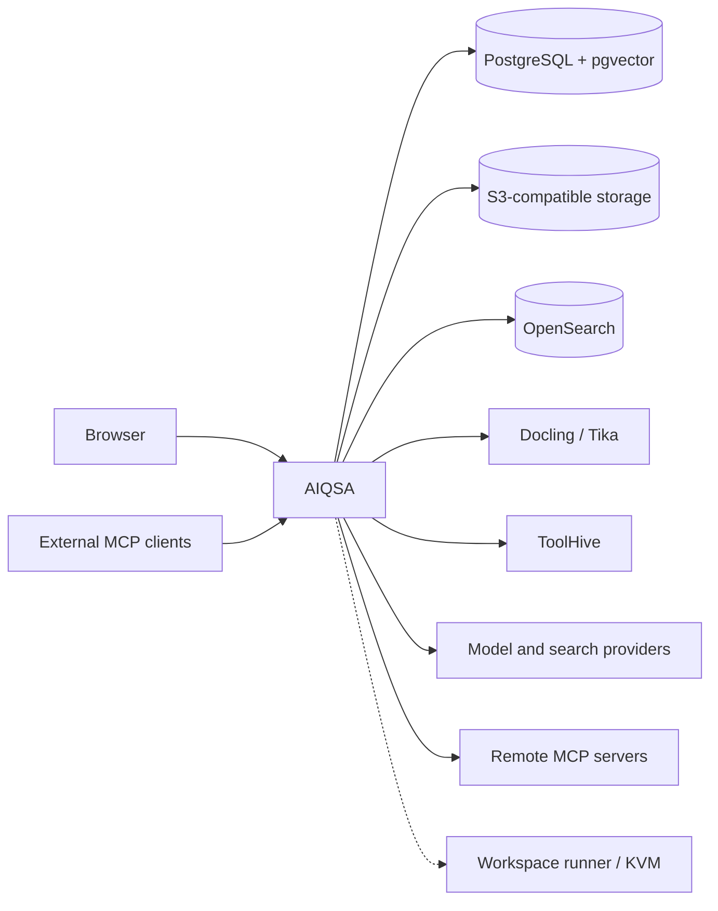

# Architecture and integrations

AIQSA is a TypeScript application built with Next.js and Node.js. The browser UI, HTTP endpoints, application logic, and external adapters live in one repository. The deployment model uses one application replica with supporting services on the same host; production provisioning is maintained separately by the installation operator.

## Components

- **PostgreSQL and pgvector** store accounts, conversations, configuration, run state, and vectors.
- **S3-compatible storage** holds attachments, Knowledge documents, and generated files. The local development stack uses MinIO.
- **OpenSearch** provides lexical indexes for Knowledge and Memory. These indexes can be rebuilt from PostgreSQL data.
- **Docling and Apache Tika** extract document content, including printed Russian and English text from scans and images.
- **ToolHive** runs configured MCP servers in sibling containers. Remote MCP servers connect over Streamable HTTP.
- **Workspace** runs commands and file operations in Microsandbox micro-VMs. It requires KVM and a separately configured runner; the development stack exposes a `workspace` profile.

## Integrations

| Area | Options |
| --- | --- |
| Models | OpenAI, Anthropic, Gemini, DeepSeek, OpenRouter, OpenAI-compatible endpoints |
| Web search | OpenAI, Anthropic, Gemini Google Search grounding, DeepSeek, Perplexity Sonar through OpenRouter |
| MCP servers | Remote Streamable HTTP; npm, PyPI, or OCI servers managed by ToolHive |
| Documents | PDF, office, and text formats through Docling and Tika, with Russian and English OCR |
| Sign-in | Email and password with invitations; optional Google and Yandex OAuth |
| Published images | Application images for amd64 and arm64, plus a companion PostgreSQL image with pgvector |

Administrators configure provider credentials, models, search integrations, SMTP, MCP servers, and access groups in the Control Center. Model and tool availability depends on the installation configuration and the user's access.
